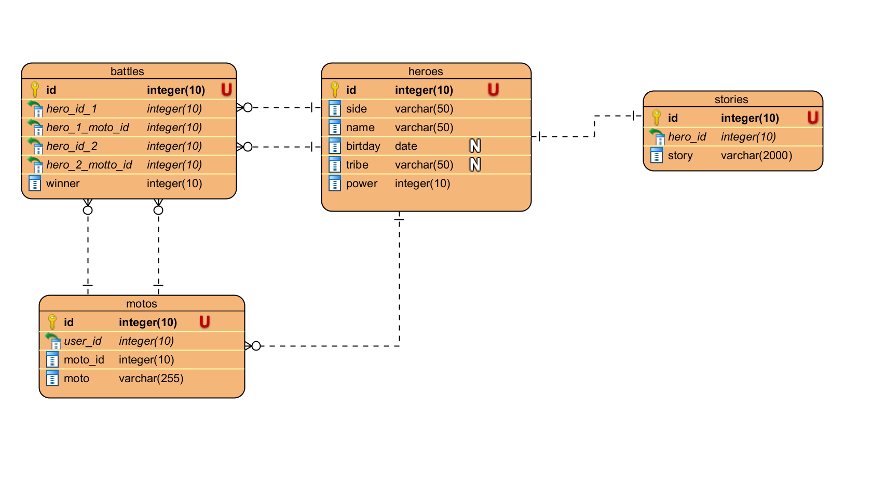

# Horizons world
Данный проект - небольшая симуляция игры Horizons: Zero Dawn. 
С его помощью можно добавить героев, информацию о них, а также 
генерировать сражения и записывать их исходы.

## Описание таблиц
### Схема базы данных


### Описание
Основные таблицы:
- **Герои:** id, сторона, имя, племя, день рождения, сила героя, сторона, на которой он сражается - 
по дефолту, все сражаются за Элой на стороне Карха Солнца. При удалении данных из этой таблицы
Данные о героях удаляются отовсюду, кроме таблицы столкновений 
- **Слоганы героев:** id, hero_id, motto_id (для каждого героя нумерация начинается
с 0), текст слогана. У каждого героя может быть от 1-го до нескольких слоганов (связь 1 ко многим) 
- **Столкновения героев:** id, hero_1_id, hero_1_motto_id (= id таблицы слоганов), hero_2_id, hero_2_motto_id, 
winner (0 для ничьей, 1 для героя 1, 2 для героя 2). Герой 1 - случайный герой.
- **Краткая предыстория героя без спойлеров:** id, hero_id, story. 
1 герой - строго 1 история. При добавлении истории герою, у которого уже есть история, история 
перезаписывается

## Развертывание проекта
 
Конфигурация запуска проекта лежит в файлах **docker-compose.yml** и
**docker-compose.prod.yml** - для разработки и продакшена соответственно.
В них используются данные переменного окружения из файлов **.env.dev** или **.env.prod**.
При необходимости, параметры запуска можно изменить внутри этих файлов.

Также некоторые настройки проекта задаются в файле **.env** в папке src. А именно: 
- **токен** для отправки телеграм-ботом лог-сообщений в чат 
- **id группы в телеграмме**, в которую бот будет по умолчанию писать логи (вступить в нее можно по ссылке 
https://t.me/+tWkdPlHzos8yZTQ6)
- **строка подключения** для базы данных, с которой нужно работать в случае неуспешного получения данных из 
файлов .env.prod и .env.dev (Например,при попытке работать с проектом через IDE)

### development: docker
Для разработки можно выполнить следующую команду из корня проекта:
```Linux Kernel Module
docker-compose up -d --build
```
В результате выполнения команды запустятся 2 контейнера: с базой данных postgres
и со средой python. Установятся все необходимые зависимости, 
а таккже выполнится скрипт по созданию базы данных и заполнению ее данными.


### production: docker
Для запуска проекта на продакшене можно выполнить следующую команду из корня проекта:
```Linux Kernel Module
docker-compose -f docker-compose.prod.yml up -d --build
```

Чтобы остановить контейнеры, введите команду:
```Linux Kernel Module
docker-compose -f docker-compose.prod.yml down -v
```

## Работа с проектом
После того как проект запущен (локально или в докере), с ним можно взаимодействовать через командную строку. Для этого необходимо перейти 
в папку src. В терминале можно выполнить следующие команды:
**1. Получить справку обо всех командах:** 
```Linux Kernel Module
python -m scripts
```
**2. Получить справку по выполнению команды:** 
```Linux Kernel Module
python -m scripts [COMMAND] --help
```
**3. Добавить героя c определенным именем:**
```Linux Kernel Module
python -m scripts add-hero NAME 
```
Также можно указать следующие параметры: 
   - **--side** TEXT - сторона, на которой сражается герой. По дефолту игроки сражаются 
   на стороне Элой, за Карха Солнца. Доступные значения: SUN_CARCHA, SHADOW_CARCHA. Значения, отличные от этого, вызовут
*NoSuchHeroSideException*
   - **--birthday** TEXT - день рождения героя в ISO формате. Все значения, отличные от этого, 
вызовут _IncorrectHeroBirthdayException_
   - **--tribe** TEXT - племя, в котором герой был рожден
   - **--power** INTEGER  - сила героя, которая влияет на вероятность его победы (если честно, пока не влияет),
   но мб в будущих релизах будет. Дефолтное значение - 0

**4. Добавить битву между героями:** 
```Linux Kernel Module
python -m scripts add-battle
```

При этом рандомно выбирается человек с одной стороны, человек с другой 
стороны, их девизы и победитель. Данные добавляется в таблицу battles

**5. Добавить девиз героя для сражения:** 
```Linux Kernel Module
python -m scripts add-motto HERO_ID TEXT
```
Если такого героя не существует, то скрипт падает с ошибкой HeroNotFoundException

**7. Добавить предысторию героя:** 
```Linux Kernel Module
python -m scripts add-story HERO_ID TEXT
```

Если такого героя не существует, то скрипт падает с ошибкой HeroNotFoundException.
Если у героя уже существует исторя, то скрипт перезаписывает существующее значение

**8. Удалить героя:** 
```Linux Kernel Module
python -m scripts delete-hero HERO_ID
```
Удаляет героя из базы данных. При этом удаляютс все его девизы для сражений и предыстория.
Информация о герое остается в сражениях. 
При удалении у пользователя запрашивается информация о том, хочет ли он удалить героя. Можно указать флаг `--force`,
чтобы вопроса не было.
Если такого героя не существует, то скрипт кидает предупреждение о том, что такого героя нет

**9. Вывести всю информацию из базы данных:**
```Linux Kernel Module
python -m scripts database-dump
```
Служебный скрипт, чтобы вывести все значения из базы данных (например, для удобства отладки)

**10. Создать представление со статистической информацией:**
```Linux Kernel Module
python -m scripts create-statistics-view
```
Служебный скрипт, который создает представление со статистической информацией, 
а именно: 
- Всего героев
- Героев стороны Карха Солнца
- Героев стороны Карха Тьмы
- Всего сражений
- Победителей со стороны Карха Солнца
- Победителей со стороны Карха Тьмы
- Всего слоганов
- Слоганов героев Карха Солнца
- Слоганов героев Карха Тьмы

**Скрипт пересоздает view, если ранее view с таким именем уже существовало в системе!**

**11. Вывести всю информацию из представления со статистической информацией:**
```Linux Kernel Module
python -m scripts get-statistics
```
Скрипт для вывода всех значений из упомянутого в прошлом пункте представления 
в консоль.

**12. Создание и заполнение базы данных:**
```Linux Kernel Module
python manage.py
```
С помощью этой команды можно вызывать скрипт создания базы данных и заполнения ее 
тестовыми данными о 6 героях, их девизах, историях, и 10 тестовых сражений.
**Настоятельно не рекомендуется использовать при сборке на проде - ВСЕ ДАННЫЕ БУДУТ СТЕРТЫ**
